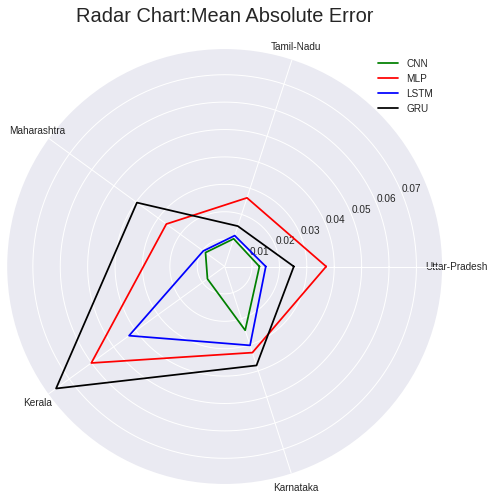
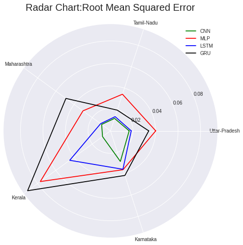
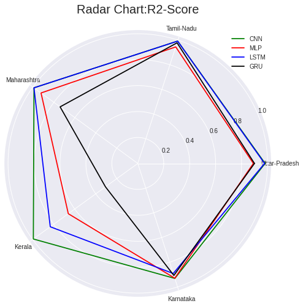
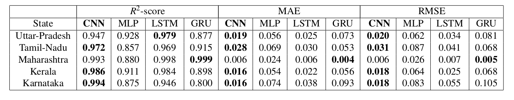
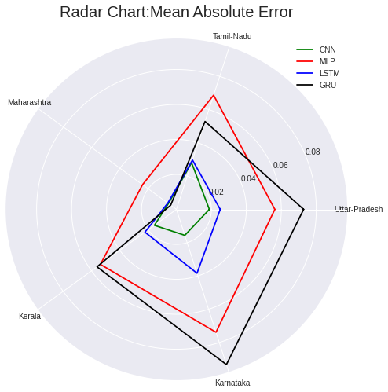
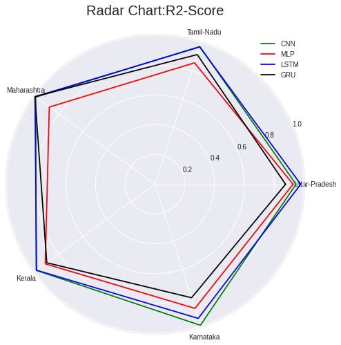

# COVID-19 Cases Forecasting in India using Neural Networks

## 📌 Project Overview

This project focuses on implementing multiple artificial neural network models to forecast COVID-19 cases in India. The objective is to evaluate different deep learning techniques for both short-term and long-term predictions and determine the most effective model.

The project is inspired by the study **"Multiple-Input Deep CNN Model for COVID-19 Forecasting in China" by Huang et al.**, which emphasizes the need for a neural network-based approach capable of predicting COVID-19 cases even with limited training data.

### 🔬 Models Implemented:
- **Multilayer Perceptron (MLP)**
- **Convolutional Neural Network (CNN)**
- **Long Short-Term Memory (LSTM)**
- **Gated Recurrent Unit (GRU)**

Each model predicts daily cumulative confirmed COVID-19 cases using data from the previous five days and six influential features. The models are implemented in **PyTorch** and **Keras**, but PyTorch is used for the final results.

---

## 📂 Project Structure

```
COVID-19-Forecasting/
│── src/                 # Source code files
│   ├── config.py        # Configuration settings
│   ├── model.py         # Neural network model implementations
│   ├── evaluation.py    # Evaluation metrics (R2, RMSE, MAE)
│   ├── data_preparation.py  # Data preprocessing and feature engineering
│   ├── model_fit_code.py    # Model training and validation
│   ├── fetch_covid_data.py  # Data fetching script
│   ├── main.py         # Main script to run the project
│
│── outputs/             # Model output files and performance visualization
│   
│── data/                # COVID-19 datasets for different Indian states
│── documents/           # Research papers and references
│── requirements.txt     # Dependencies
│── README.md            # Project documentation
```

---

## 📊 Key Findings

- **The CNN model outperforms all other models in both short-term and long-term forecasting.**
- The models were trained and tested on COVID-19 data from five Indian states.
- Model performance is evaluated using **R² score, RMSE, and MAE.**

### 📅 Dataset:
- **Long-term data:** March 10, 2020 – June 30, 2021
- **Short-term data:** March 10, 2020 – June 18, 2020

---

## 📌 Results on Short-Term Data

### Model Predictions:


### Mean Absolute Error (MAE):


### Root Mean Squared Error (RMSE):


### R² Score:


---

## 📌 Results on Long-Term Data

### Model Predictions:


### Mean Absolute Error (MAE):


### Root Mean Squared Error (RMSE):


### R² Score:


---

## 🛠 Setup & Installation

### 1️⃣ Clone the repository:
```bash
git clone https://github.com/sureshkuc/COVID-19-Forecasting.git
```

### 2️⃣ Install dependencies:
```bash
pip install -r requirements.txt
```

### 3️⃣ Prepare the dataset:
- Place the dataset files inside the `data/` folder.

### 4️⃣ Run the model training:
```bash
python src/main.py
```

---

## 📝 License
This project is licensed under the **MIT License**. See the [LICENSE](LICENSE) file for more details.

---

## 🤝 Contributing
We welcome contributions! Feel free to submit pull requests for improvements and new features.

---

## 📧 Contact
For any questions or collaboration opportunities, reach out to:
- **Email**: skcberlin@gmail.com
- **LinkedIn**: 

